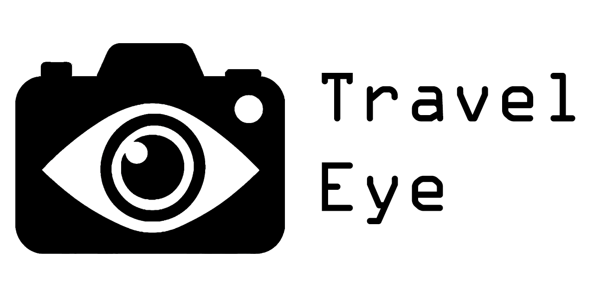
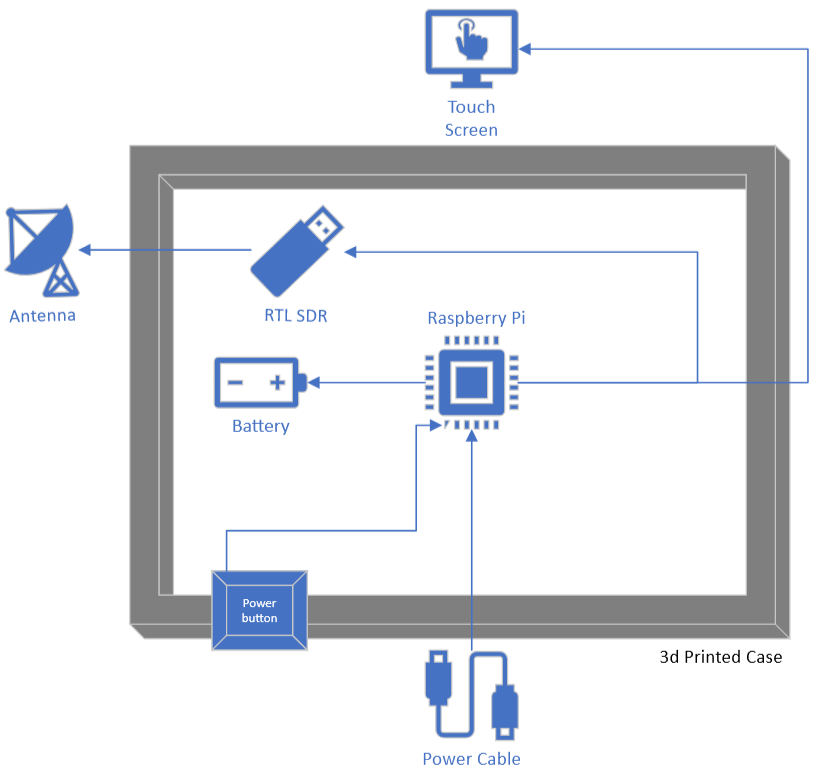

# TravelEye

  

## About
*Created by Owen Campain, Adam Wisnewski, Jacob Philips, Erand Bizati*

TravelEye is a portable device which used radio frequency detection to find hidden surveillance devices.
This device is aimed towards travelers with any level of technical knowledge

This project was created for a capstone course (CSC355) at Kutztown University

## Installation
### Materials
This device was made with one specific list of components; however, this project could be recreated with slightly different components and still function. Below are the generic components required for the project along with exact models used by the team in parenthesis.
- RTL-SDR (V3)
- Raspberry Pi (3B+)
- Raspberry Pi Battery (PiSugar S Plus)
- Touch Screen (Hosyond 7-inch HDMI)
- SMA Antenna (Bingfu BFN00419)
- Normal Open Button (Twidec Push Button 7mm) 

This project uses a custom 3D printed case. The STL file for printing can be found in the repository `TravelEyeCase.stl`. Black PLA filament was used for the final case. Case design is based on the exact parts used therefore, if any components are swapped out, the case might no longer fit all components

### Assembly
The following diagram shows the layout of all the device components within the case

  

The screen is connected to the Raspberry Pi via HDMI. The screen is also powered by the Raspberry Pi by connecting a USB type A port of the Raspberry Pi to one of the micro-USB ports on the screen

The RTL SDR is connected to the Raspberry Pi via USB Type A. USB Type A male to female cable was used in order for the RTL-SDR to fit inside of the case, however the RTL-SDR could be connected directly.

The antenna is attached to the RTL-SDR using the SMA connector.

The power button uses the number 5 and 6 pin on the Raspberry Pi

### Software Requirements
The TravelEye program runs off the Raspberry Pi which should be running Raspbian OS. Before being able to run program though, there are a few dependencies that need to be installed first

- [RTL SDR Drivers](https://www.rtl-sdr.com/rtl-sdr-quick-start-guide/)
- [PyQt5](https://pypi.org/project/PyQt5/)
- [pi-power-button](https://github.com/Howchoo/pi-power-button.git)

### Running TravelEye
One the device has been assembled and all software requirements have been installed, TravelEye is ready to run

First make sure that `TravelEye.py`, `multipleChoiceMenu.py`, `MultiSigDetection.py` are located in the same folder before running

You can then start the program by running `TravelEye.py`

## Making Scan Adjustments
Scanning for such a wide range of different frequencies can be a challenge

There are many small adjustments to how this device scans which can affect what devices are found

There are two things that can be easily changed which can affect how the device works in different scenarios. You can adjust these values to make the device better suit your environment

### **Search list**

  This is the list of all frequencies which TravelEye will scan for.
  This list is contained in `dangerousFrequencies.txt`.

  You can add or remove any frequencies on this list. Keep in mind that all values are in MHz. The effective frequency range this device can scan for is 24 – 1766 MHz
 
  *Caution: The length of the list affects the length of scans. Adding too many frequencies can slow down the scan time. *

### Threshold
  This value represents the strength of the signal for it to be considered found. TravelEye collects data for all signals that were on the search list, however it only shows signals that we found to be above the threshold. 
  This value can be changed to make TravelEye more or less sensitive for finding signals 

  This value is contained in `MultiSigDetection.py` using the `THRESHOLD` variable. The threshold is measured in decibels

  *Caution: The UI and threshold was adjusted to only show the most prominent signals in order to not overwhelm the user with too many signals which might not be relevant. Making the threshold too low may cause all signals to be displayed which could break the UI* 
  
