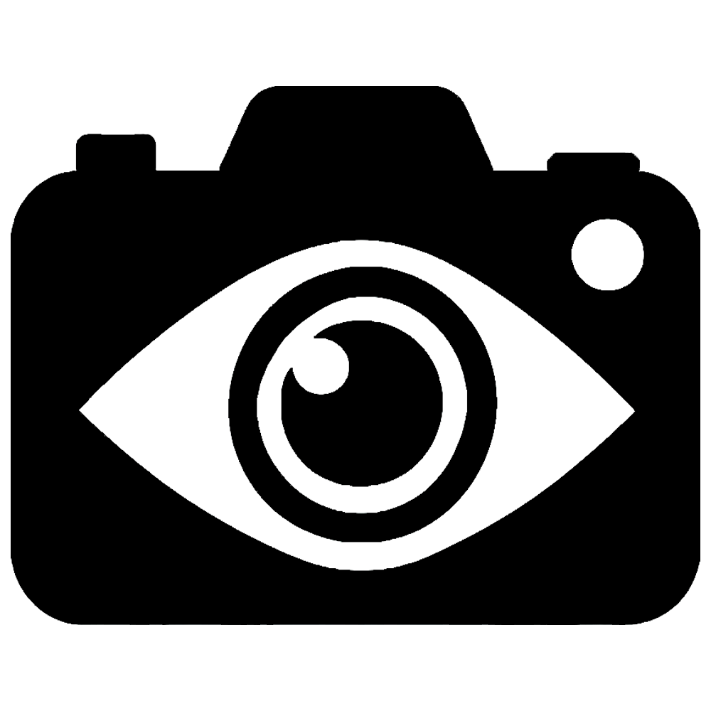

# TravelEye

## About
*Created by Owen Campain, Adam Wisnewski, Jacob Philips, Erand Bizati*

TravelEye is a portable device which used radio frequency detection to find hidden surveilance devices
This device is aimed towards travelers with any level of technical knowledge

This project was created for a capstone course (CSC355) at Kutztown University

## Installation
### Materials
- RTL SDR
- Raspberry Pi
- Raspberry pi battery
- Touch Screen
- SMA Antenna
- Normal Open Button

This project uses a custom 3D printed case. The STL file for printing can be found in the repository

### Assembly
Image of architechture

The above image is how the components are arranged in the case

The screen is connected via HDMI and micro usb

The RTL SDR is connected via usb with the antenna attached to the dongle

The power button uses the number 5 and 6 pin on the raspberry pi

### Software
The TravelEye program runs off the Raspberry Pi which should be running raspian OS. Before being able to run program though, there are a few dependecies that need to be installed first

- [RTL SDR Drivers](https://www.rtl-sdr.com/rtl-sdr-quick-start-guide/)
- [PyQt5](https://pypi.org/project/PyQt5/)
- [pi-power-button](https://github.com/Howchoo/pi-power-button.git)
